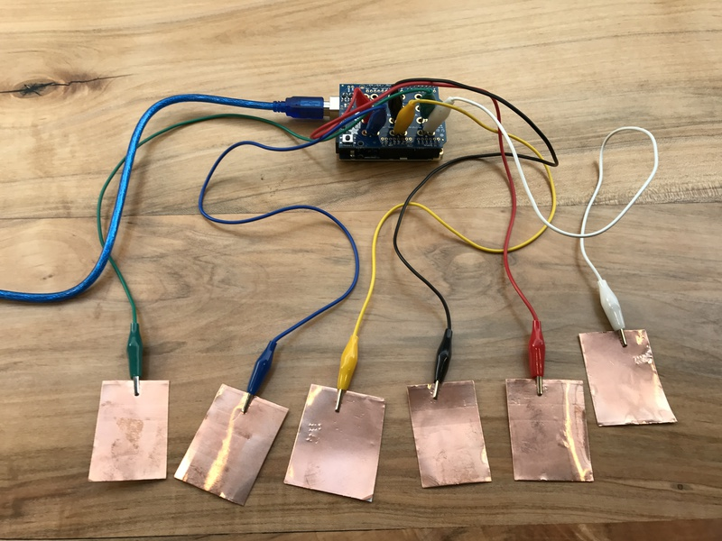
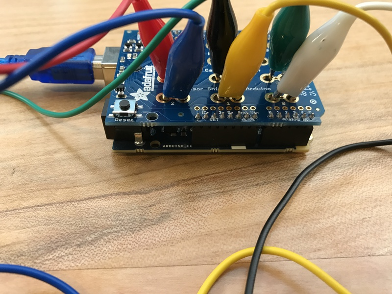
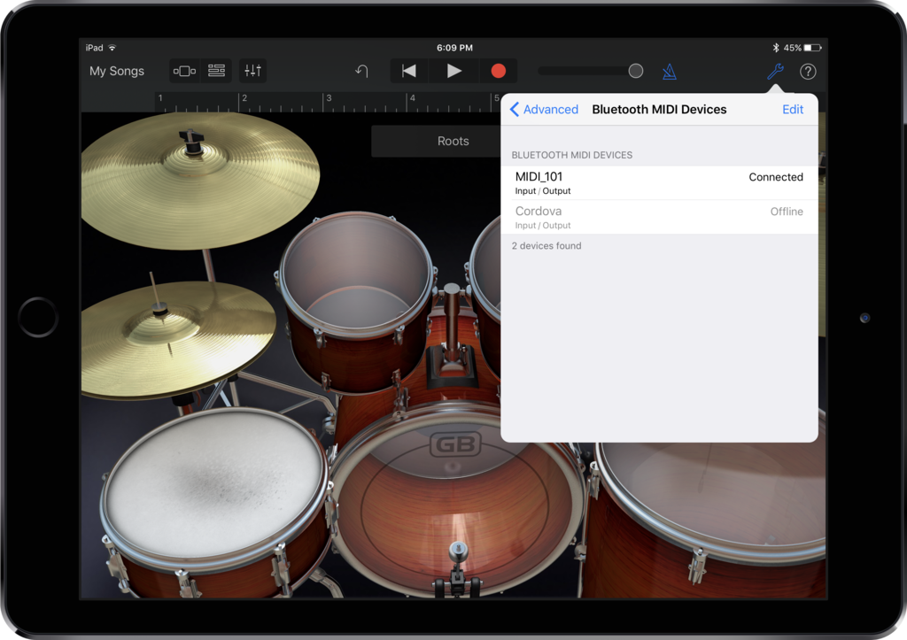

# Arduino 101 Bluetooth MIDI Controller

Materials
 * [Arduino 101](https://www.arduino.cc/en/Main/ArduinoBoard101)
 * [Adafruit 12 x Capacitive Touch Shield](https://www.adafruit.com/products/2024)
 * Alligator clip jumper wires
 * Copper tape

[Code](Arduino101BluetoothMIDI.ino)

